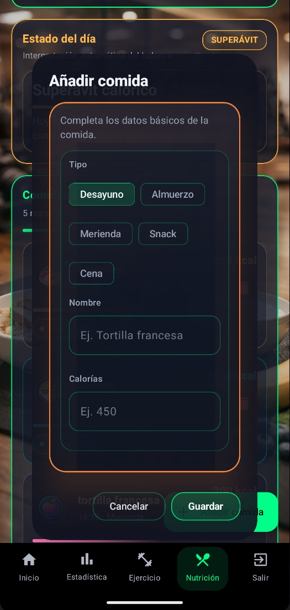
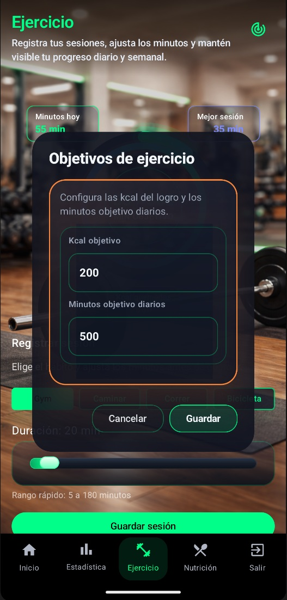

# Fitt4Sences — Android HealthTech Portfolio Project


## Overview

**Fitt4Sences** is a modern Android HealthTech application focused on **fitness, wellness, nutrition, hydration and physical metrics tracking**.

It was developed as a **Final Degree Project** and is presented here as a **professional portfolio showcase** for recruiters, companies and technical teams.

This repository does **not** include the source code or APK.  
Instead, it showcases the project through its **architecture, UI design, backend approach, screenshots, videos and roadmap**.

> Real Android project. Real architecture. Real backend. Premium UI. AI-ready roadmap.

---

## Why this project stands out

- Built as a real **Android native application**
- Developed with **Kotlin** and **Jetpack Compose**
- Structured using **MVVM**, **StateFlow** and **Repository Pattern**
- Connected to a real backend with **Supabase** and **PostgreSQL**
- Includes modules for **physical metrics, hydration, nutrition and exercise**
- Designed with a **premium UI/UX approach**
- Prepared for future **AI-driven recommendations and wellness insights**
- Versioned and managed with Git, following an organized commit-based workflow

---

## Tech Stack

| Area | Technologies |
|---|---|
| Mobile Development | Android, Kotlin |
| UI | Jetpack Compose |
| Architecture | MVVM, ViewModel, StateFlow, Repository Pattern |
| Backend | Supabase |
| Database | PostgreSQL |
| Security | Supabase Auth, Row Level Security |
| Product Domain | Fitness, Wellness, HealthTech |
| Future Vision | AI-ready architecture |
| Version Control | Git, GitHub |

---

## App Screenshots 

<table>
  <tr>
    <td width="50%" valign="top">
      <h3>Intro & Login</h3>
      
      
    </td>
    <td width="50%" valign="top">
      <h3>Dashboard</h3>
      
      
    </td>
  </tr>

  <tr>
    <td width="50%" valign="top">
      <h3>Metrics</h3>
      
      
    </td>
    <td width="50%" valign="top">
      <h3>Nutrition</h3>
      
      
    </td>
  </tr>

  <tr>
    <td width="50%" valign="top">
      <h3>Select</h3>
      
      
    </td>
    <td width="50%" valign="top">
      <h3>Hydration</h3>
      
      
    </td>
  </tr>
</table>
  
</table>
---

## Demo Videos

### Spanish Demo
[Watch the Spanish presentation video](https://YOUR-LINK-HERE)

### English Demo
[Watch the English presentation video]([https://YOUR-LINK-HERE](https://youtu.be/ZO3j8SlBqL0))

> If needed, videos can also be embedded as thumbnails linked to YouTube or Google Drive.

---

## TFG Documentation This repository includes a summarized version of the Final Degree Project documentation in both Spanish and English. 

- [Resumen del TFG en Español](docs/TFG_Fitt4Sences_resumen_ES.pdf)
- [Final Degree Project Summary in English](docs/TFG_Fitt4Sences_summary_EN.pdf)

---

## Core Modules

### Physical Metrics
Users can register personal physical data such as **weight, height, age and sex**, enabling the app to generate useful wellness indicators.

### Nutrition
The nutrition module is designed to track meals, calories and daily energy balance.

### Hydration
Users can record their daily water intake and monitor progress toward hydration goals.

### Exercise & Habits
The exercise module allows users to manage habits, register sessions and estimate burned calories.

### Dashboard
A central dashboard gives a visual summary of the user’s health and wellness activity.

---

## Architecture

Fitt4Sences follows a modern Android architecture:

```text
Compose UI
   ↓
ViewModel
   ↓
Repository
   ↓
Supabase Client
   ↓
PostgreSQL / RLS / backend logic
   ↓
Repository
   ↓
ViewModel
   ↓
StateFlow
   ↓
Compose UI
```

---

About the Developer

Developed by Javier.

Android Developer focused on Kotlin, Jetpack Compose, Supabase, PostgreSQL, UI/UX and product-oriented mobile applications.

Contact

[](mailto:flow4sences@gmail.com)
[](https://www.linkedin.com/in/francisco-javier-jimenez-cortes-232137332/)
[](https://github.com/Diblock)
