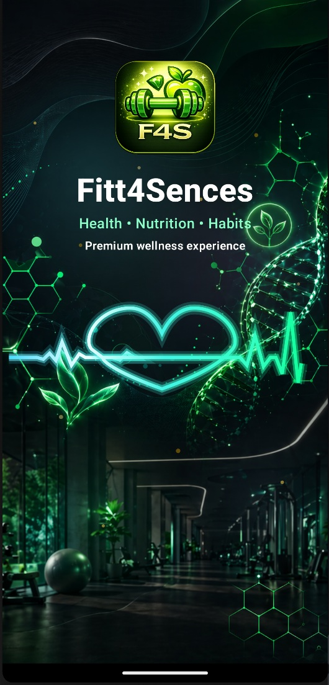
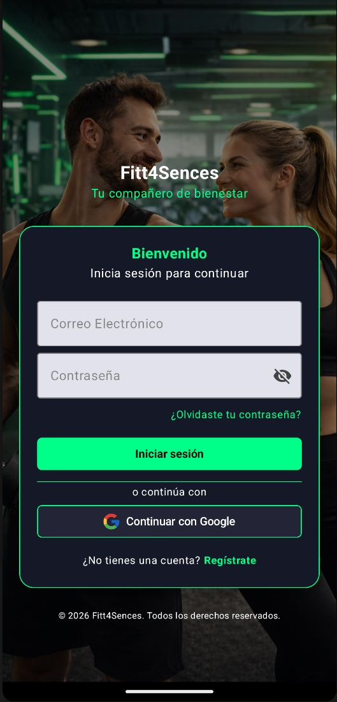
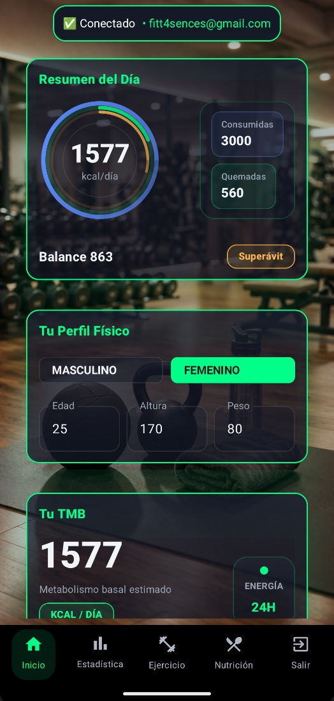
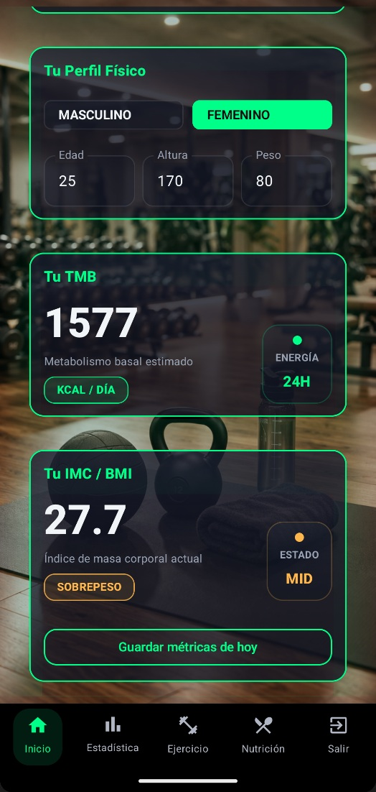
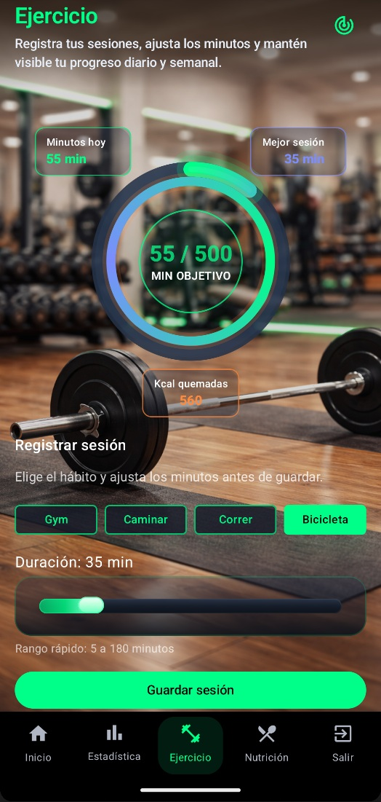
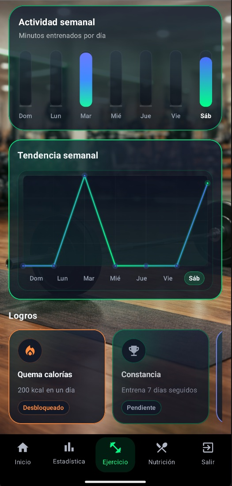
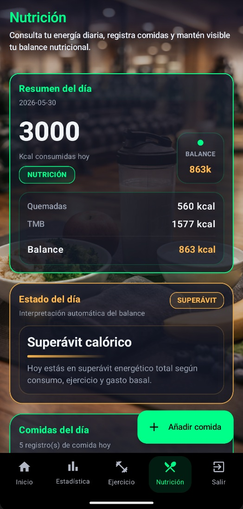
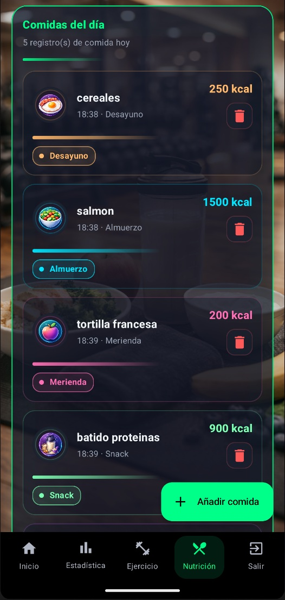
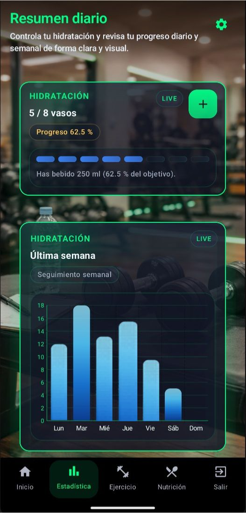
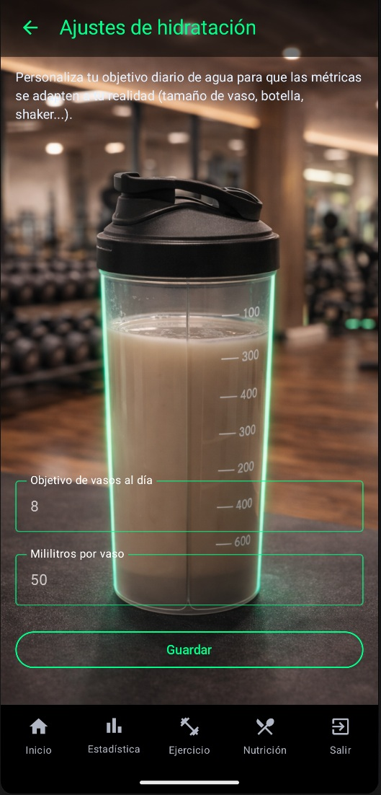

# Fitt4Sences — Proyecto Android HealthTech de Portfolio


## Descripción general

**Fitt4Sences** es una aplicación Android HealthTech moderna centrada en el seguimiento de **fitness, bienestar, nutrición, hidratación y métricas físicas**.

Fue desarrollada como **Trabajo de Fin de Grado** y se presenta aquí como una **muestra profesional de portfolio** para recruiters, empresas y equipos técnicos.

Este repositorio **no** incluye el código fuente ni el APK.  
En su lugar, muestra el proyecto a través de su **arquitectura, diseño UI, enfoque backend, capturas de pantalla, vídeos y hoja de ruta**.

> Proyecto Android real. Arquitectura real. Backend real. UI premium. Hoja de ruta preparada para IA.

---

## Por qué destaca este proyecto

- Construido como una **aplicación Android nativa real**
- Desarrollado con **Kotlin** y **Jetpack Compose**
- Estructurado usando **MVVM**, **StateFlow** y **Repository Pattern**
- Conectado a un backend real con **Supabase** y **PostgreSQL**
- Incluye módulos de **métricas físicas, hidratación, nutrición y ejercicio**
- Diseñado con un enfoque **UI/UX premium**
- Preparado para futuras **recomendaciones impulsadas por IA e insights de bienestar**

---

## Stack tecnológico

| Área | Tecnologías |
|---|---|
| Desarrollo móvil | Android, Kotlin |
| UI | Jetpack Compose |
| Arquitectura | MVVM, ViewModel, StateFlow, Repository Pattern |
| Backend | Supabase |
| Base de datos | PostgreSQL |
| Seguridad | Supabase Auth, Row Level Security |
| Dominio del producto | Fitness, Bienestar, HealthTech |
| Visión futura | Arquitectura preparada para IA |

---

## Capturas de la app

## App Screenshots

<table>
  <tr>
    <td width="50%" valign="top">
      <h3>Intro & Login</h3>
      
      
    </td>
    <td width="50%" valign="top">
      <h3>Dashboard</h3>
      
      
    </td>
  </tr>

  <tr>
    <td width="50%" valign="top">
      <h3>Physical Metrics</h3>
      
      
    </td>
    <td width="50%" valign="top">
      <h3>Nutrition</h3>
      
      
    </td>
  </tr>

  <tr>
    <td width="50%" valign="top">
      <h3>Hydration</h3>
      
      
    </td>
    <td width="50%" valign="top">
    </td>
  </tr>
</table>

---
---

## Vídeos demo

### Demo en español

[Ver el vídeo de presentación en español](https://YOUR-LINK-HERE)

### Demo en inglés

[Ver el vídeo de presentación en inglés](https://YOUR-LINK-HERE)

> Si es necesario, los vídeos también pueden insertarse como miniaturas enlazadas a YouTube o Google Drive.

---

## Módulos principales

### Métricas físicas

Los usuarios pueden registrar datos físicos personales como **peso, altura, edad y sexo**, permitiendo que la app genere indicadores útiles de bienestar.

### Nutrición

El módulo de nutrición está diseñado para registrar comidas, calorías y el balance energético diario.

### Hidratación

Los usuarios pueden registrar su consumo diario de agua y controlar el progreso hacia sus objetivos de hidratación.

### Ejercicio y hábitos

El módulo de ejercicio permite gestionar hábitos, registrar sesiones y estimar las calorías quemadas.

### Dashboard

Un dashboard central ofrece un resumen visual de la actividad de salud y bienestar del usuario.

---

## Arquitectura

Fitt4Sences sigue una arquitectura Android moderna:

```text
Compose UI
   ↓
ViewModel
   ↓
Repository
   ↓
Supabase Client
   ↓
PostgreSQL / RLS / lógica backend
   ↓
Repository
   ↓
ViewModel
   ↓
StateFlow
   ↓
Compose UI
```

---

## Sobre el desarrollador

Desarrollado por Javier.

Android Developer centrado en Kotlin, Jetpack Compose, Supabase, PostgreSQL, UI/UX y aplicaciones móviles orientadas a producto.

---

## Contacto

[](mailto:flow4sences@gmail.com)

[](https://www.linkedin.com/in/francisco-javier-jimenez-cortes-232137332/)

[](https://github.com/Diblock)
